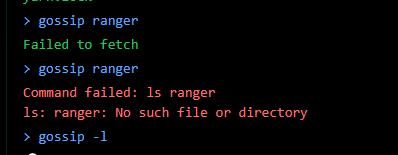

# Summary

## Web
- [Whispers of the Moonbeam](#whispers)
- [Trial by fire](#trial)

## OSINT
- [The Stone That Whispers](#stone)
- [Echoes in Stone](#echoes)
- [The Mechanical Bird's Nest](#bird)

## IA

- [Mirror Witch](#mirror)

# whispers

The challenge says that you are an adventurer that comes inside a tavern. The website takes the form of a chat which is a command shell where you can use some commands to roll dices or ask for a drink.
I have done some tries and after some time I noticed something : 




I could see that the "ls" command seemed available even if it should not have worked.

I therefore tried some commands to print the flag and I finally got it : 


And there we can see the flag.


# trial

When we open the website, we find that page : 


I tried to do some code injections in that page but nothing worked.

Then, when we enter a name we end up on a fighting screen : 


At the end of the fight, we have another page loading : 


When we look at the source-code we can see that there is a function which uses user inputs : 

```php

@web.route('/battle-report', methods=['POST'])
def battle_report():
    stats = {
        . . .
        'damage_dealt': request.form.get('damage_dealt', "0"),
        'turns_survived': request.form.get('turns_survived', "0")
        . . .
    }

    REPORT_TEMPLATE = f"""
        . . .
        <p class="title">Battle Statistics</p>
        <p>🗡️ Damage Dealt: <span class="nes-text is-success">{stats['damage_dealt']}</span></p>
        . . .
        <p>⏱️ Turns Survived: <span class="nes-text is-primary">{stats['turns_survived']}</span></p>
        . . .
    """

    return render_template_string(REPORT_TEMPLATE)
```

So I tried to see if i could inject some things that would be executed. When I injected {{ 7 * 7 }}, I got 49 as an answer. 
I then told the server to "cat flag.txt" and got the flag.

# stone

We get a photo of a particular stone : 


I supply used google reverse research to find its name : 


And that was the flag : HTB{Lia_Fall} 

# echoes

Same as before we get the photo of a cross : 


Same way, I used google reverse research and find its name : 


And the flag is : HTB{Muiredach_high_cross}

# bird

We got that image : 


By using google reverse research I found out that this photo was taken in the area 51. I then used Google Maps and looked for an helicopter. When i found it I just look at the coordinates (Latitude: 37°14'49.5" N
Longitude: 115°48'44.3" W) and that was the flag.

# mirror

In that challenge we had to talk with an AI (like ChatGPT) to get it to give us the names of some secret places. The difficulty was that it "knew" that those were secret and would not give their names away if we simply asked for it. Therefore we had to try to trick it into revelling the names.

We tried to manipulate it by telling it that the places were not that secret, that we had a mission to do ect...
That leading to nothing, we did some research about it and found out that we could make it give us some code we the informations we want in it.

We then asked it to give a list of the places with 0 and 1 to mark them.


That is how we tricked it into giving us the names of the secret places.